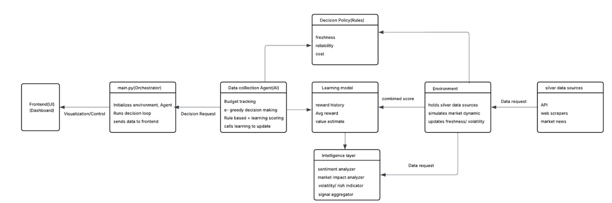
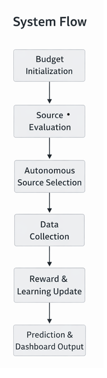

<<<<<<< HEAD
Data Intelligence System 
AI-Driven Market & Sentiment Intelligence Platform
=======

>>>>>>> f9be911d59a71de8e1f153974d73beab5662f36b

Event: Echelon 2.0 Hackathon

Overview
The Data Intelligence System is an AI-powered platform that continuously collects market and news data, performs sentiment and pricing analysis, and delivers actionable insights through an intelligent backend agent and a real-time analytics dashboard.
The system simulates an autonomous data intelligence agent capable of monitoring multiple information sources and generating decision-ready outputs.
The system combines:

📊 Real-time market price monitoring
📰 News sentiment intelligence
🤖 Automated data collection agent
⚡ FastAPI-based AI backend
🖥️ Interactive analytics dashboard
🔄 Modular intelligence pipeline
📈 Decision visualization panels

-------------------------------------------------------------
Project Architecture:
DATA_INTELLIGENCE_AGENT
│
├── backend/      → FastAPI AI data agent
├── frontend/     → React + Vite analytics dashboard
└── README.md

Backend
  -> FastAPI server
  -> Data collection agents
  -> Market intelligence modules
  -> Sentiment analysis pipeline

Frontend
  -> React + TypeScript dashboard
  -> Real-time visualization
  -> Agent activity monitoring

System Architecture:
  

System Flow:
  
------------------------------------------------------------------------------
⚙️ Tech Stack
Backend
  ->  Python
  ->  Reinforcement Learning (Multi-Armed Bandit Learning)
  ->  ARIMA (Time-Series Forecasting)
  ->  FastAPI
  ->  Uvicorn
  ->  REST APIs
  ->  JSON/CSV data storage
  ->  External Data APIs (Alpha Vantage, GNews)
Frontend
  ->  React
  ->  TypeScript
  ->  Vite
  ->  Tailwind CSS
------------------------------------------------------------------------------
🧩 Features

✅ Automated data collection agent
✅ Market price monitoring
✅ News sentiment analysis
✅ Decision intelligence pipeline
✅ Real-time dashboard visualization
✅ Modular AI architecture
-------------------------------------------------------------------------------
🛠️ Setup Instructions

1️⃣ Clone Repository
    git clone https://github.com/1xcodes-Swapnil/Data-Intelligence-System.git
    cd DATA_INTELLIGENCE_AGENT

🔹 Backend Setup
2️⃣ Create Virtual Environment
    Windows
      python -m venv venv
      venv\Scripts\activate

    Mac/Linux
      python3 -m venv venv
      source venv/bin/activate

3️⃣ Install Dependencies
    pip install -r requirements.txt

4️⃣ Configure API Keys
    Create a .env file in the project root:
      ALPHA_VANTAGE_API_KEY=your_alpha_vantage_key
      GNEWS_API_KEY=your_gnews_api_key

    Alternatively configure inside config.py:
      ALPHA_KEY = "your_alpha_vantage_key"
      GNEWS_KEY = "your_gnews_api_key"

5️⃣ Verify Intelligence Modules
    Ensure the following modules exist:
      -> intelligence/sentiment.py
      -> intelligence/market.py
      -> utils/price_fetcher.py

6️⃣ Run Backend Server
    uvicorn main:app --reload

  Backend runs at:
    http://localhost:8000

🔹 Frontend Setup
7️⃣ Navigate to Frontend
    cd frontend

8️⃣ Install Dependencies
    npm install

9️⃣ Start Development Server
    npm run dev
    
    You should see:
    VITE ready
    Local: http://localhost:8080/

🔗 Connect Frontend with Backend

  Ensure backend is running:
    uvicorn main:app --reload

  Frontend API endpoint:
    http://localhost:8000/silver/predict

  Update the API base URL inside frontend configuration if required.

📊 Dashboard Access

  Open in browser:
    http://localhost:8080/

This launches the Data Intelligence Dashboard UI.
------------------------------------------------------------------------------

Future Improvements

=>  Multi-agent orchestration
=>  Real-time streaming pipelines
=>  ML model optimization
=>  Cloud deployment (Docker + AWS)