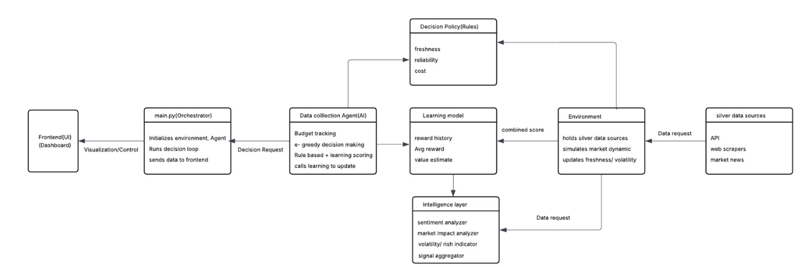
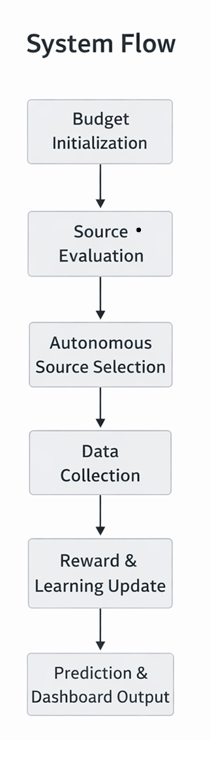

# 📊 Data Intelligence System

### Market Intelligence • Sentiment Analysis • Price Forecasting

<p align="center">
  <strong>AI-driven intelligence for understanding market signals from prices and financial news.</strong>
</p>

<p align="center">
  
  
  
  
</p>

---

## ⚡ What is it?

**Data Intelligence System** is an AI-powered platform that brings together **market data, financial news, sentiment analysis, and price forecasting** into a single intelligence pipeline.

Instead of looking at market prices and news separately, the system processes these signals together and presents the resulting intelligence through an interactive dashboard.

```text
Market Data ───────┐
                   │
                   ▼
              ┌───────────┐
News Data ───►│Intelligence│
              │  Pipeline  │
              └─────┬─────┘
                    │
        ┌───────────┼───────────┐
        ▼           ▼           ▼
    Sentiment    Forecasting  Decisions
        │           │           │
        └───────────┼───────────┘
                    ▼
             Analytics Dashboard
```

---

## 🧠 Intelligence Pipeline

```text
┌────────────────────┐
│  External Sources  │
│                    │
│ Alpha Vantage      │
│ GNews              │
└─────────┬──────────┘
          │
          ▼
┌────────────────────┐
│  Data Collection   │
│      Agent         │
└─────────┬──────────┘
          │
          ▼
┌────────────────────────────────┐
│      Intelligence Layer        │
│                                │
│  Market Analysis               │
│  Sentiment Analysis            │
│  ARIMA Forecasting             │
│  Multi-Armed Bandit Learning   │
└───────────────┬────────────────┘
                │
                ▼
┌────────────────────────┐
│     FastAPI Backend    │
└────────────┬───────────┘
             │
             ▼
┌────────────────────────┐
│   React Dashboard      │
│                        │
│  Market │ Sentiment    │
│  Forecasts │ Signals   │
└────────────────────────┘
```

---

## ✨ Core Capabilities

|     | Capability                | Description                              |
| --- | ------------------------- | ---------------------------------------- |
| 📊  | **Market Monitoring**     | Tracks market price data                 |
| 📰  | **News Intelligence**     | Collects financial news                  |
| 🧠  | **Sentiment Analysis**    | Extracts sentiment signals from news     |
| 📈  | **Price Forecasting**     | Uses ARIMA for time-series prediction    |
| 🎯  | **Decision Intelligence** | Uses Multi-Armed Bandit learning         |
| 🤖  | **Data Agent**            | Automates data collection and processing |
| 🖥️ | **Analytics Dashboard**   | Visualizes intelligence in real time     |

---

## 🏗️ Architecture



### System Flow



---

## 🛠️ Tech Stack

### Backend

`Python` · `FastAPI` · `Uvicorn` · `ARIMA` · `Multi-Armed Bandit`

### Frontend

`React` · `TypeScript` · `Vite` · `Tailwind CSS`

### Data Sources

`Alpha Vantage` · `GNews API`

### Storage

`JSON` · `CSV`

---

## 📁 Project Structure

```text
DATA_INTELLIGENCE_AGENT/
│
├── backend/
│   ├── intelligence/
│   │   ├── sentiment.py
│   │   └── market.py
│   │
│   ├── utils/
│   │   └── price_fetcher.py
│   │
│   └── main.py
│
├── frontend/
│   ├── src/
│   ├── public/
│   └── package.json
│
├── docs/
│   ├── architecture.png
│   └── System_flow.png
│
├── requirements.txt
└── README.md
```

---

## 🚀 Getting Started

### 1. Clone

```bash
git clone https://github.com/1xcodes-Swapnil/Data-Intelligence-System.git
cd DATA_INTELLIGENCE_AGENT
```

### 2. Backend

Create and activate a virtual environment:

```bash
python -m venv venv
```

**Windows**

```bash
venv\Scripts\activate
```

**Mac/Linux**

```bash
source venv/bin/activate
```

Install dependencies:

```bash
pip install -r requirements.txt
```

### 3. Configure API Keys

Create `.env`:

```env
ALPHA_VANTAGE_API_KEY=your_alpha_vantage_key
GNEWS_API_KEY=your_gnews_api_key
```

### 4. Start Backend

```bash
uvicorn main:app --reload
```

Backend:

`http://localhost:8000`

### 5. Start Frontend

```bash
cd frontend
npm install
npm run dev
```

Dashboard:

`http://localhost:8080/`

---

## 🔌 API

### Silver Price Prediction

```http
GET /silver/predict
```

```text
http://localhost:8000/silver/predict
```

FastAPI documentation:

```text
http://localhost:8000/docs
```

---

## 👥 Team

**Swapnil Mukherjee** · **Hriday Sonawane** · **Minal Dusane** · **Astha Patil**

---

<p align="center">
  <strong>DATA → INTELLIGENCE → PREDICTION → DECISION</strong>
</p>

<p align="center">
  Built for <strong>Hackathon</strong>
</p>
